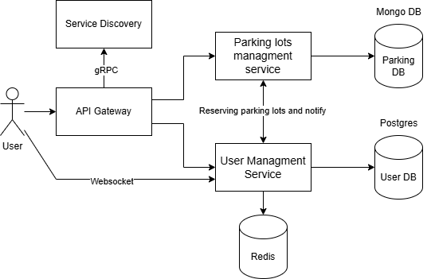

# Smart-Parking
## Application Suitability
1. Why is this application relevant?
- Universities often face challenges with limited parking spaces. A smart system can optimize parking allocation, reducing time spent by students and faculty searching for spaces.
- Automating the process of finding, reserving, and monitoring parking slots can improve traffic management and user convenience. It offers real-time updates and predictive analytics for space availability.
- Such systems can scale to accommodate more users or integrate with other smart campus systems like security or transport services.
2. Why does this application require a microservice architecture?
- A Smart Parking System may have numerous separate components (for example, parking spot identification, user notifications, payments, and reservations). Using microservices enables modular development, with each service being developed, deployed, and scaled independently.
- In a microservice architecture, the failure of one service (for example, payment processing) does not bring down the entire system. Other services, such as space detection and notifications, can continue to run.
## Service Boundaries

- User managment service will handle everything about user like authentication and notification.
- Parking lots managment service will handle reservation and parking lots tracking system
## Technology Stack and Communication Patterns
- Parking lots managment service
  - Python (RESTful API with Flask)
  - MongoDB
- User managment service
  - Python (RESTful API with Flask)
  - PostgreSQL
  - Redis
  - Websocket (websockets library)
## Data Managment
* Parking lots managment service:
```
    /api/parking/lots - Retrieves the list of available parking lots along with their status (available, reserved, occupied).
    /api/parking/lots/<lot_id> - Retrieves detailed information about a specific parking lot.
    /api/parking/reservations - Makes a parking reservation for the user, specifying the parking lot and time.
    /api/parking/reservations/cancel - Cancels an existing parking reservation.
    /api/parking/lots/update - Updates the status of a parking lot based on sensor data or manual entry.
```
* User managment service:
```
    /api/users/auth/signup - Creates a new user account with required details
    /api/users/auth/signin - Authenticates a user and generates a session token.
    /api/users/auth/signout - Invalidates a user session and logs out the user.
    /api/users/profile - Fetches the authenticated user's profile details.
    /api/users/profile/update - Updates user profile information
    /api/users/notifications - Retrieves the list of notifications for the user.
    /api/users/notifications/mark-as-read - Marks specific notifications as read for the user.
    /api/users/notifications/ws - WebSocket endpoint for real-time notifications
    /api/users/reservations - Retrieves the user's past parking reservations.
```
## Deployment and Scaling
Docker containers will be created for deployment, and Docker compose will be used for scalability and administration.
  
